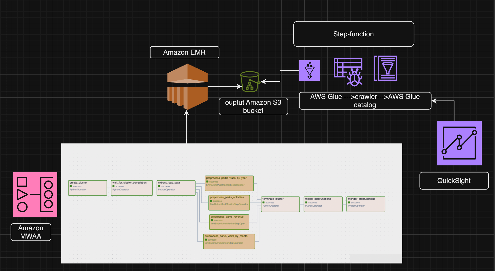
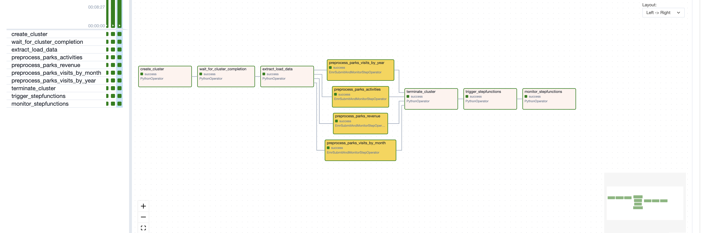
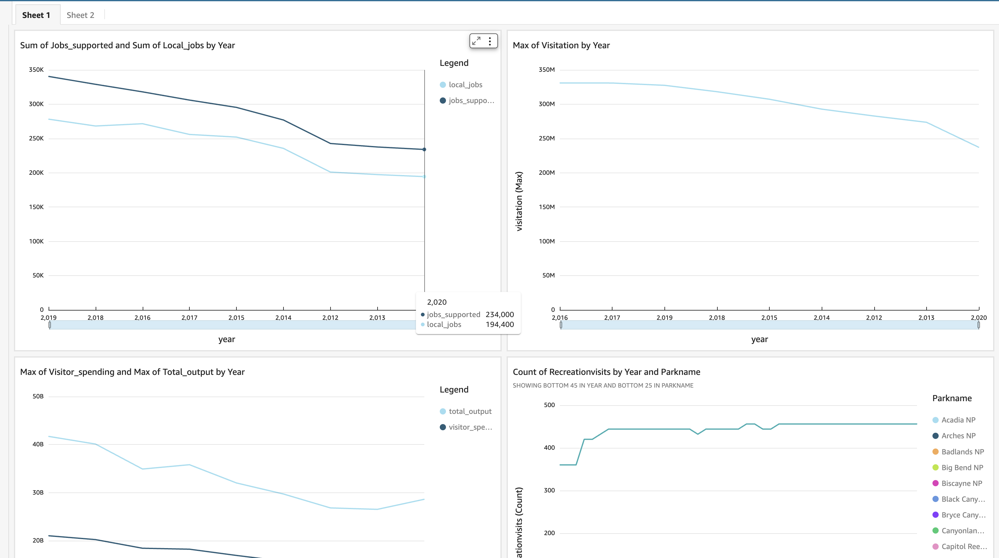

# National Parks Data Engineering Capstone Project

## Project Title
Building a Data Pipeline for Analyzing National Parks Data

## Project Overview
National parks are a vital part of natural heritage, attracting millions of visitors each year and contributing significantly to local economies. By combining multiple datasets, the aim is to derive and share meaningful insights about visitation trends, economic impact, park popularity, seasonal patterns, and visitor demographics. This project was chosen due to the diverse data available, which provides an excellent opportunity to showcase data engineering skills while contributing to the understanding and preservation of these treasured national parks. The goal of this project is to build a robust data pipeline to ingest, transform, store, and analyze data related to national parks.

## Datasets
- **Parks and Activities Data**: Retrieve national parks that are related to particular categories of activity like astronomy, hiking, wildlife watching, etc. [API Documentation](https://www.nps.gov/subjects/developer/api-documentation.htm#/)
This dataset retrived data all the activities in the national park and is updated every two hours.
- **Annual Visitation and Economic Impact Data**: Contains annual visitation, visitor spending, jobs supported, local jobs, and total output data from 2012 to 2020. [VSE 2020](https://www.nps.gov/orgs/1207/vse2020.html)
- **NPS Stats**: Contains monthly visitation data for national parks from 1979 to 2023. [NPS Stats](https://irma.nps.gov/Stats/Reports/National)
- **Monthly Visitation Data**: [US-NATIONAL-PARKS_USE_1979-2023_BY-MONTH.CSV](sample-data/US-National-Parks_Use_1979-2023_By-Month.csv)

## Tech Stack and Workflow

## Architecture

## Dag functions 

DAG Tasks Description
Create EMR Cluster (create_cluster)

Description: This task creates an Amazon EMR cluster that will be used to run the subsequent Spark jobs.
Function: create_emr
Operator: PythonOperator
Wait for Cluster Completion (wait_for_cluster_completion)

Description: This task waits for the EMR cluster to be ready to accept jobs. It ensures that the cluster is in a running state before proceeding.
Function: wait_for_completion
Operator: PythonOperator
Extract and Load Park Activity Data (extract_load_data)

Description: This task extracts park activity data from an external API, processes it into a CSV format, and uploads it to an S3 bucket.
Function: extract_load_park_activity_data
Operator: PythonOperator
Preprocess Parks Activities (preprocess_parks_activities)

Description: This task submits a Spark job to preprocess parks activities data. The job is run on the EMR cluster.
Operator: EmrSubmitAndMonitorStepOperator
Preprocess Parks Revenue (preprocess_parks_revenue)

Description: This task submits a Spark job to preprocess parks revenue data. The job is run on the EMR cluster.
Operator: EmrSubmitAndMonitorStepOperator
Preprocess Parks Visits by Month (preprocess_parks_visits_by_month)

Description: This task submits a Spark job to preprocess parks visits data by month. The job is run on the EMR cluster.
Operator: EmrSubmitAndMonitorStepOperator
Preprocess Parks Visits by Year (preprocess_parks_visits_by_year)

Description: This task submits a Spark job to preprocess parks visits data by year. The job is run on the EMR cluster.
Operator: EmrSubmitAndMonitorStepOperator
Terminate EMR Cluster (terminate_cluster)

Description: This task terminates the EMR cluster after all preprocessing tasks are completed.
Function: terminate_emr
Operator: PythonOperator
Trigger Step Functions (trigger_stepfunctions)

Description: This task triggers an AWS Step Function to start a state machine execution.
Function: trigger_step_function
Operator: PythonOperator
Monitor Step Functions (monitor_stepfunctions)

Description: This task monitors the execution of the Step Function triggered in the previous task.
Function: monitor_step_function
Operator: PythonOperator
DAG Dependencies
The DAG starts with creating the EMR cluster.
It then waits for the cluster to be ready.
Once the cluster is ready, it extracts and loads park activity data.
The data extraction task triggers four preprocessing tasks in parallel: preprocess_parks_activities, preprocess_parks_revenue, preprocess_parks_visits_by_month, and preprocess_parks_visits_by_year.
After all preprocessing tasks are completed, the EMR cluster is terminated.
Finally, the DAG triggers and monitors an AWS Step Function.
For more details, refer to the np_dag.py file.

EmrSubmitAndMonitorStepOperator
The EmrSubmitAndMonitorStepOperator is a custom Airflow operator designed to submit steps to an existing Amazon EMR cluster and monitor their execution. This operator is useful for running complex data processing tasks using Apache Spark or other Hadoop ecosystem tools on an EMR cluster.

Key Features
Submit Steps to EMR Cluster:

The operator allows you to submit one or more steps to an existing EMR cluster. Steps can be defined as a list of dictionaries in the boto3 format or as a reference to a JSON file containing the steps.
Monitor Step Execution:

The operator can monitor the execution of the submitted steps. It periodically checks the status of the steps and logs their progress. If a step fails, the operator raises an exception.
Templated Fields:

The operator supports templated fields, allowing you to dynamically set values such as job_flow_id, job_flow_name, cluster_states, and steps using Airflow's templating system.
XCom Push:

The operator can push the job_flow_id to XCom, making it available for downstream tasks.

## Glue Tables for Athena Queries

The following Glue tables are created to facilitate querying national park data in Athena:

1. **Park Visits by Year**
   - **Description**: This table contains yearly visitation data for each national park.
   - **Schema**: `ParkName STRING, Region STRING, State STRING, Year STRING, RecreationVisits STRING`
   - **SQL File**: [park_visit_by_year.sql](./setup/aws_glue_tables_in_athena/park_visit_by_year.sql)

2. **Park Visits by Month**
   - **Description**: This table contains monthly visitation data for each national park.
   - **Schema**: `ParkName STRING, UnitCode STRING, ParkType STRING, Region STRING, State STRING, Year STRING, Month STRING, RecreationVisits STRING`
   - **SQL File**: [park_visit_by_month.sql](./setup/aws_glue_tables_in_athena/park_visit_by_month.sql)

3. **Parks Revenue Data**
   - **Description**: This table contains revenue data for national parks, including visitor spending and economic impact.
   - **Schema**: `Year INT, Visitation INT, Visitor_Spending DOUBLE, Jobs_Supported INT, Local_Jobs INT, Total_Output DOUBLE`
   - **SQL File**: [park_revenue_data.sql](./setup/aws_glue_tables_in_athena/park_revenue_data.sql)

4. **Parks Activity Data**
   - **Description**: This table contains activity data for national parks, including park details and activities.
   - **Schema**: `park_states STRING, park_parkCode STRING, park_designation STRING, park_fullName STRING, park_url STRING, park_name STRING, id STRING, name STRING`
   - **SQL File**: [park_activity_data.sql](./setup/aws_glue_tables_in_athena/park_activity_data.sql)

## Work in Progress

This project is a work in progress. I am currently working on developing a QuickSight dashboard to visualize the national park data. The dashboard will provide insights into visitation trends, economic impact, park popularity, and seasonal patterns.

For a glimpse of what the dashboard will look like, 

## Athena querries
 [SQL File](./setup/athena_querries/increasing_decreasingvistation)
[SQL File](./setup/athena_querries/visitation_each_yaer_and_categories_of_activity.sql)
[SQL File](./setup/athena_querries/vistitation_trends.sql)

## Challenges faced:
1. Understanding AWS Permissions
Complexity of IAM Policies: AWS Identity and Access Management (IAM) policies can be complex and require a deep understanding of the permissions needed for various services. Ensuring that the EMR clusters, Lambda functions, and Step Functions had the correct permissions to interact with each other was a significant challenge.
Least Privilege Principle: Implementing the principle of least privilege, where each service and role only has the permissions necessary to perform its tasks, required careful planning and testing. This involved creating and refining multiple IAM roles and policies, such as those defined in default-emr-roles.yaml, additional_policy.json, and packaged-template.yaml.
Service-Linked Roles: Understanding and setting up service-linked roles, such as the EMRCleanupServiceLinkedRole in emr_cleanup_role.yaml, was essential for allowing AWS services to manage resources on our behalf.
2. Implementing the Pipeline Workflow
DAG Configuration: Configuring the Directed Acyclic Graph (DAG) in Airflow to manage the workflow was challenging. This involved defining tasks, setting dependencies, and ensuring that tasks executed in the correct order. The np_dag.py file contains the DAG configuration, which required careful planning and testing.
EMR Cluster Management: Managing the lifecycle of the EMR cluster, including creation, monitoring, and termination, was complex. The EmrSubmitAndMonitorStepOperator in emr_submit_and_monitor_step.py was used to submit steps to the EMR cluster and monitor their execution, which required a thorough understanding of EMR and boto3.
Data Extraction and Processing: Extracting data from external APIs, processing it, and uploading it to S3 required handling various edge cases and ensuring data integrity. The extract_load_park_activity_data function in np_dag.py handles this process.
3. Figuring Out the CloudFormation Templates
Template Structure: Understanding the structure and syntax of CloudFormation templates was crucial. The project involved multiple templates, such as default-emr-roles.yaml, packaged-template.yaml, and emr_cleanup_role.yaml, each serving different purposes.
Resource Dependencies: Ensuring that resources were created in the correct order and that dependencies were properly defined was challenging. This involved using intrinsic functions like Fn::Sub and Ref to reference other resources and parameters within the templates.
Debugging and Testing: Debugging CloudFormation templates can be difficult, especially when dealing with complex templates and multiple resources. Testing the templates thoroughly to ensure they created the desired resources without errors was a time-consuming process.# aws-mwaa-emr
